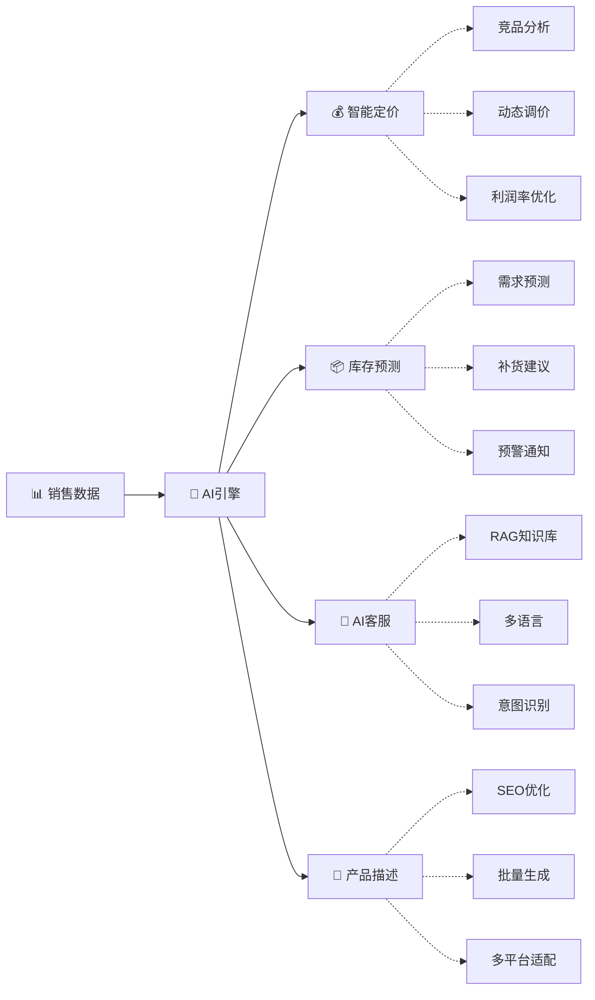

# 🌍 OmniTrade ERP - 跨境电商智能ERP系统

<div align="center">

[](https://www.oracle.com/java/)
[](https://spring.io/projects/spring-boot)
[](https://spring.io/projects/spring-cloud)
[](https://vuejs.org/)
[](LICENSE)
[](https://github.com/nplszfl/erp/stargazers)
[](https://github.com/nplszfl/erp/network)

</div>

---

<div align="center">


**🚀 基于Spring Cloud Alibaba微服务架构 | 10+主流平台 | 日处理10万+订单 | AI智能驱动**

*[English](README_EN.md) | [中文](README.md) | [文档](https://docs.omnitradeerp.com)*

</div>

---

## ⭐ 为什么选择 OmniTrade ERP？

| 特性 | 说明 |
|------|------|
| 🤖 **AI原生架构** | 从设计之初融入AI能力，智能定价、库存预测、AI客服不是后期叠加，而是核心能力 |
| ⚡ **高性能** | Java 21虚拟线程 + Spring WebFlux响应式编程，单节点轻松支撑5000+ QPS |
| 🏗️ **生产级架构** | 完整微服务生态：Nacos/Sentinel/Gateway/RocketMQ，开箱即用 |
| 🌐 **全平台覆盖** | Amazon、eBay、Shopee、Lazada、TikTok Shop...一个系统管理所有店铺 |
| 📦 **一键部署** | Docker Compose / Kubernetes 多部署方式，5分钟启动完整环境 |
| 💰 **零成本起步** | 开源免费，MySQL + Redis + RabbitMQ 即可运行，无需商业中间件 |

---

## 🏆 与同类项目对比

| 功能 | OmniTrade ERP | 某商业ERP | 某开源ERP |
|------|---------------|-----------|-----------|
| 价格 | 🆓 完全免费 | 💰💰💰 年费数万 | 🆓 部分免费 |
| AI能力 | 🤖 内置4大AI服务 | ⚠️ 付费插件 | ❌ 无 |
| 平台数量 | 10+ 持续增加 | 5-8 | 3-5 |
| 源码开放 | ✅ 完全开源 | ❌ 闭源 | ⚠️ 部分开源 |
| 二次开发 | ✅ 随意定制 | ❌ 限制多多 | ⚠️ 有限 |
| 部署方式 | Docker/K8s/裸机 | SaaS Only | 仅Docker |
| 技术栈 | Java 21 + Vue 3 | Java 8 + jQuery | Python + Vue 2 |

---

## ✨ 核心AI能力 (v1.5.0+)



| AI服务 | 功能描述 | 状态 |
|--------|----------|------|
| 🧠 **智能定价** | 竞品数据抓取 + 成本加成 + 动态调价策略 | ✅ 已完成 |
| 📊 **库存预测** | Prophet/ARIMA时间序列预测 + 智能补货建议 | ✅ 已完成 |
| 💬 **AI客服** | RAG知识库 + DeepSeek/ChatGPT集成 + 多语言 | ✅ 已完成 |
| 📝 **产品描述** | AI生成SEO优化描述 + 多平台模板 | ✅ 已完成 |

> 💡 **提示**: 配置API Key后即可启用真实LLM调用，支持DeepSeek/OpenAI/Azure OpenAI

---

## 🏗️ 技术架构

### 后端技术栈

| 技术 | 版本 | 说明 |
|------|------|------|
| Spring Boot | 3.3.5 | 基础框架 |
| Spring Cloud | 2024.0.1 | 微服务框架 |
| Spring Cloud Alibaba | 2024.0.0 | 阿里云微服务 |
| JDK | 21 | 虚拟线程支持 |
| MyBatis Plus | 3.5.6 | ORM框架 |
| Nacos | 2.4+ | 服务注册/配置中心 |
| Sentinel | 1.8+ | 流量控制 |
| Gateway | - | API网关 |
| MySQL | 8.0+ | 主数据库 |
| Redis | - | 缓存 |
| RabbitMQ | - | 消息队列 |
| JWT | 0.12.3 | 用户认证 |

### 前端技术栈

| 技术 | 版本 | 说明 |
|------|------|------|
| Vue | 3.4 | 前端框架 |
| TypeScript | - | 类型系统 |
| Vite | 5.0 | 构建工具 |
| Element Plus | - | UI组件库 |
| Pinia | - | 状态管理 |
| Axios | - | HTTP客户端 |
| ECharts | - | 数据可视化 |

---

## 📁 项目结构

```
OmniTradeERP/
├── erp-common/                  # 公共模块
│   ├── constant/               # 平台、订单状态等枚举
│   ├── config/                 # Feign、Redis等配置
│   ├── exception/              # 全局异常处理
│   └── result/                 # 统一响应封装
│
├── erp-gateway/                # 网关服务 (:8080)
│
├── erp-order-service/          # 订单服务 (:8081)
│
├── erp-platform-service/       # 平台API服务 (:8082)
│   ├── api/                    # 平台接口定义
│   └── impl/                   # 平台实现
│       ├── AmazonOrderSync.java
│       ├── EbayOrderSync.java
│       ├── ShopeeOrderSync.java
│       ├── LazadaOrderSync.java
│       └── TiktokOrderSync.java
│
├── erp-product-service/        # 商品服务 (:8083)
├── erp-user-service/           # 用户服务 (:8084)
├── erp-inventory-service/      # 库存服务 (:8085)
├── erp-warehouse-service/      # 仓库服务 (:8086)
├── erp-finance-service/        # 财务服务 (:8087)
│
# 🔥 AI服务 (v1.5.0+)
├── erp-pricing-service/        # 智能定价服务 (:8090)
├── erp-inventory-prediction-service/  # 库存预测服务 (:8091)
├── erp-ai-assistant-service/   # AI客服服务 (:8092)
├── erp-product-description-service/   # 产品描述服务 (:8093)
│
├── erp-web/                    # 前端项目
├── docker/                     # Docker配置
├── k8s/                        # Kubernetes配置
└── database/                   # 数据库脚本
```

---

## 🌐 支持平台

| 平台 | API | 状态 | 文档 |
|------|-----|------|------|
| 🛍️ Amazon | SP-API/MWS | ✅ 框架完成 | [Amazon文档](https://developer-docs.amazon.com/sp-api/) |
| 🛒 eBay | Trading API | ✅ 框架完成 | [eBay文档](https://developer.ebay.com/devzone/xml/docs/reference/ebay/) |
| 🛍️ Shopee | Open API | ✅ 框架完成 | [Shopee文档](https://open.shopee.com/documents/) |
| 🛒 Lazada | Open API | ✅ 框架完成 | [Lazada文档](https://open.lazada.com/doc/doc.htm) |
| 🎵 TikTok Shop | Open API | ✅ 框架完成 | [TikTok文档](https://partner.tiktokshop.com/doc/) |
| 🛍️ Temu | - | 📦 预留 | - |
| 🌐 速卖通 | - | 📦 预留 | - |
| 👗 SHEIN | - | 📦 预留 | - |
| 🏪 Shopify | - | 📦 预留 | - |
| 🛒 WooCommerce | - | 📦 预留 | - |

---

## 🚀 快速开始

### 方式1：Docker Compose（推荐 ⭐ 最快5分钟启动）

```bash
# 克隆项目
git clone https://github.com/nplszfl/erp.git
cd OmniTradeERP

# 一键启动
docker-compose -f docker-compose.minimal.yml up -d

# 查看服务状态
docker-compose ps

# 访问系统
# 前端：http://localhost
# Gateway：http://localhost:8080
# Nacos：http://localhost:8848 (nacos/nacos)
```

### 方式2：本地开发

```bash
# 1. 初始化数据库
mysql -u root -p < database/init.sql

# 2. 编译项目
mvn clean package -DskipTests

# 3. 启动后端（任选服务组合）
java -jar erp-gateway/target/erp-gateway-1.0.0.jar
java -jar erp-order-service/target/erp-order-service-1.0.0.jar
# ... 其他服务

# 4. 启动前端
cd erp-web && npm install && npm run dev
```

---

## 📊 性能指标

| 指标 | 数值 | 说明 |
|------|------|------|
| 日订单处理量 | 10万+ | 线性扩展 |
| 单节点QPS | 5000+ | Java 21虚拟线程 |
| 平均响应时间 | <200ms | P99 |
| 可用性 | 99.9% | K8s高可用 |
| 冷启动时间 | <30s | 容器启动 |

---

## 💡 使用场景

### 🛒 多平台卖家
> "我在Amazon、eBay、Shopee都有店铺，之前要切换5个后台，现在一个系统全搞定" - 某卖家

### 📦 库存管理困难户
> "用了智能库存预测，再也不怕突然爆单缺货，也不用担心积压库存了" - 某卖家

### 💰 定价靠拍脑袋
> "竞品价格随时变化，手动调价累死人。智能定价帮我自动优化，利润提升15%" - 某卖家

### 🌍 跨境小白
> "AI客服支持多语言，外国客户问题自动回复，省了我聘请翻译的成本" - 某卖家

---

## 🤝 贡献指南

欢迎贡献代码！请查看 [CONTRIBUTING.md](CONTRIBUTING.md)

```bash
# Fork后
git clone https://github.com/YOUR_USERNAME/erp.git
cd erp

# 创建特性分支
git checkout -b feature/amazing-feature

# 开发完成后提交PR
git push origin feature/amazing-feature
```

---

## 📝 更新日志

### v1.5.0 (2026-03-20) 🔥 AI智能运营版本

- ✨ **智能定价服务** - 竞品分析、成本加成、动态调价
- ✨ **库存预测服务** - Prophet/ARIMA模型、智能补货建议
- ✨ **AI客服助手** - RAG知识库、多语言支持
- ✨ **产品描述生成** - SEO优化、多平台模板
- ✅ 添加4个AI服务单元测试（70+测试用例）
- ✅ 支持Docker Compose多种部署模式
- ✅ K8s生产级部署配置

### v1.0.0 (2026-03-13)

- ✅ 初始版本发布
- ✅ 8个微服务架构
- ✅ 5大平台API对接
- ✅ 完整前端页面
- ✅ JWT用户认证

---

## ❓ 常见问题

**Q: 这个项目免费吗？**
A: 完全免费！MIT协议开源商用无限制。

**Q: 需要什么配置？**
A: 最低配置：4核8G服务器即可运行全套服务。

**Q: 不会Java能用的好吗？**
A: 项目封装良好，如果只需配置使用不需要开发能力。如果需要二次开发，需要Java基础。

**Q: AI功能怎么启用？**
A: 在配置文件中添加你的DeepSeek/OpenAI API Key即可。

**Q: 有商业支持吗？**
A: 目前纯开源社区支持，欢迎付费定制开发（联系方式见GitHub）。

---

## 📞 交流与支持

| 方式 | 链接 |
|------|------|
| 💬 微信群 | 添加微信 `HuangHuixiang` 备注"ERP" |
| 🐛 问题反馈 | [GitHub Issues](https://github.com/nplszfl/erp/issues) |
| ⭐ Star | [GitHub](https://github.com/nplszfl/erp) |
| 📖 文档 | [在线文档](https://docs.omnitradeerp.com) |

---

## 📄 License

MIT License - 商用免费，欢迎fork⭐

---

## 🙏 致谢

感谢以下开源项目：

- [Spring Cloud](https://spring.io/projects/spring-cloud) - 微服务框架
- [Nacos](https://nacos.io/) - 服务注册与配置
- [Sentinel](https://sentinelguard.io/) - 流量控制
- [Vue.js](https://vuejs.org/) - 前端框架
- [Element Plus](https://element-plus.org/) - UI组件库
- [ECharts](https://echarts.apache.org/) - 数据可视化

---

<div align="center">

**如果这个项目对你有帮助，请给一个 ⭐️ Star！**

用代码之火，点亮跨境电商之路 🔥

*Built with ❤️ by Huang Huixiang*

</div>